Adform Advertising iOS SDK
==============

# Getting Started

Adform brings brand advertising to the programmatic era at scale, making display advertising simple, relevant and rewarding!

## 1. General Info

The use of Adform SDK requires the following:

* Xcode 5.0 or later.
* iOS SDK 7.0 or later.
* Requires deployment target 6.0 or later

SDK is Automatic Reference Counting (ARC) compliant. 


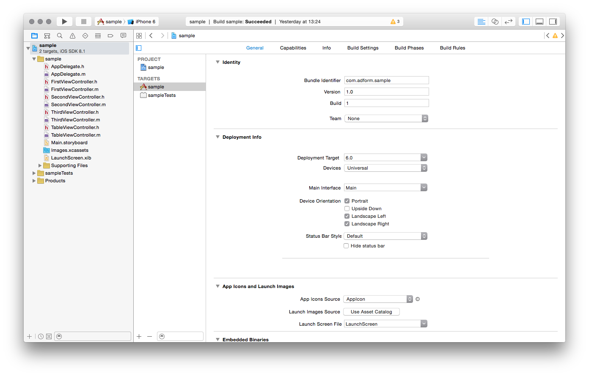

## 2. How to import Adform Advertising SDK to your iOS project?
### 2.1. Using CocoaPods

Adform Advertising SDK is now available via CocoaPods. CocoaPods is a very popular Objective-C dependency management tool. 

* To use CocoaPods, you should first install the CocoaPods Ruby Gem (CocoaPods is built with Ruby):

````
$ sudo gem install cocoapods
````

* Next, you need to create a `Podfile`, which describes what dependencies you project has. This file should be placed in your project directory. 

````
$ pod init
````

* Next, edit `Podfile` and add the platform identifier and the list of libraries you want to use in the project.

````
platform: ios

pod 'AdformAdvertising'
````

* Finally, you have to install the selected libraries.

````
pod install
````
Thats it!

For more information about CocoaPods visit [CocoaPods site](http://cocoapods.org/about).


### 2.2. Manually

* Download the latest build version of Adform Advertising SDK.
* Drag **AdformAdvertising.framework** to your project.

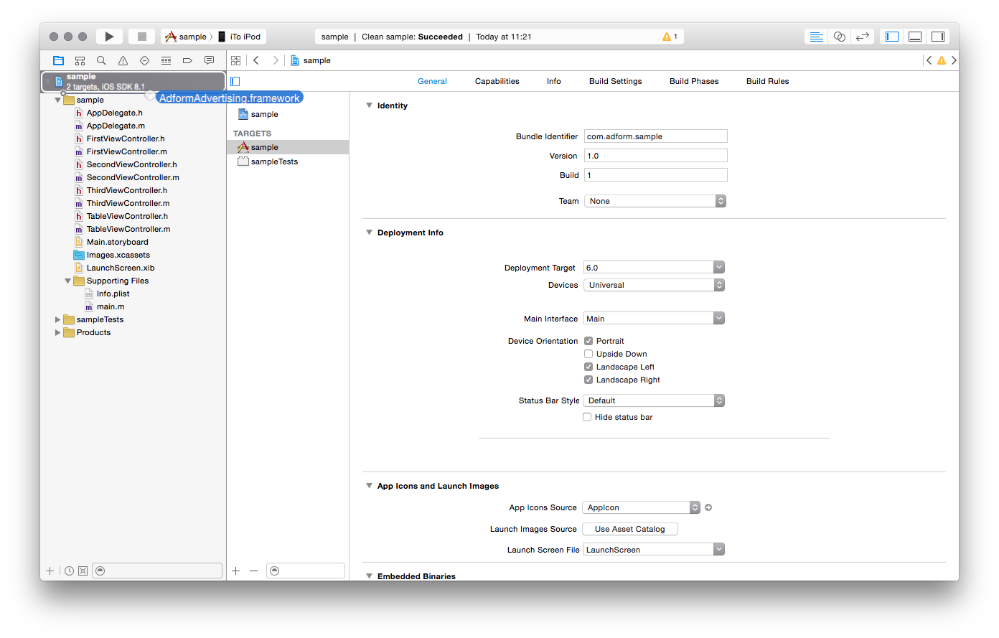

* When asked select **Copy items into destination group's folder**.

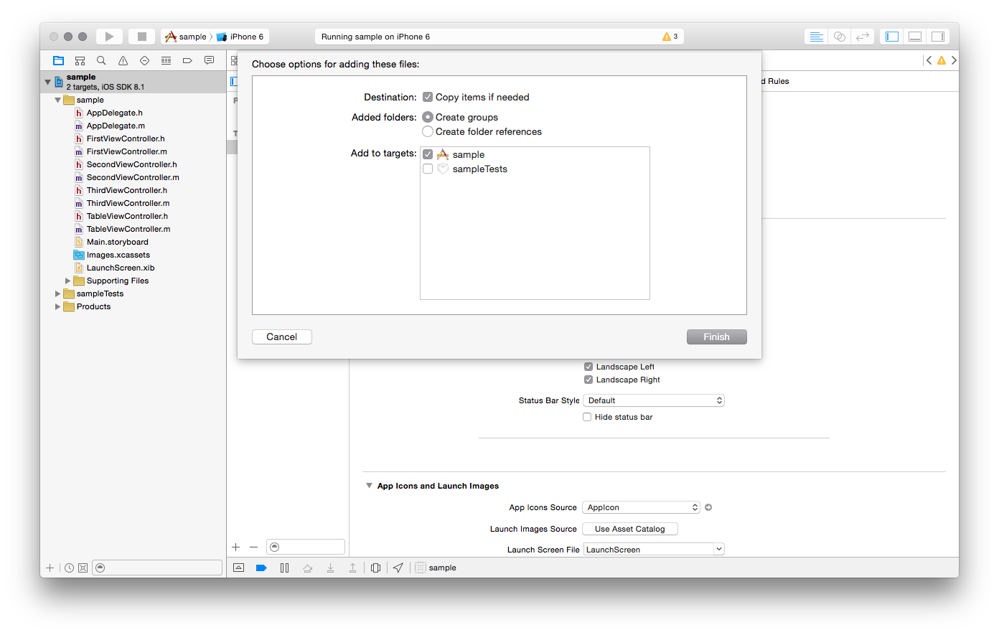

* Go to your application target’s configuration > General > Linked Frameworks and Libraries section and add these frameworks to your project:
   * **AdSupport.framework**
   * **EventKit.framework**
   * **EventKitUI.framework**
   * **MediaPlayer.framework**
   * **CoreTelephony.framework**
   * **SystemConfiguration.framework**
   
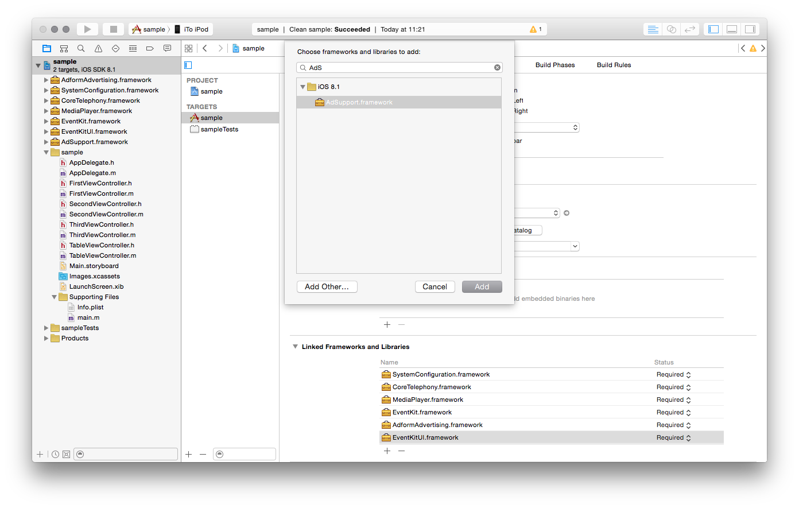

* Go to your application target’s configuration > Build settings > Linking > Other Linker Flags, and set **-ObjC** flag.

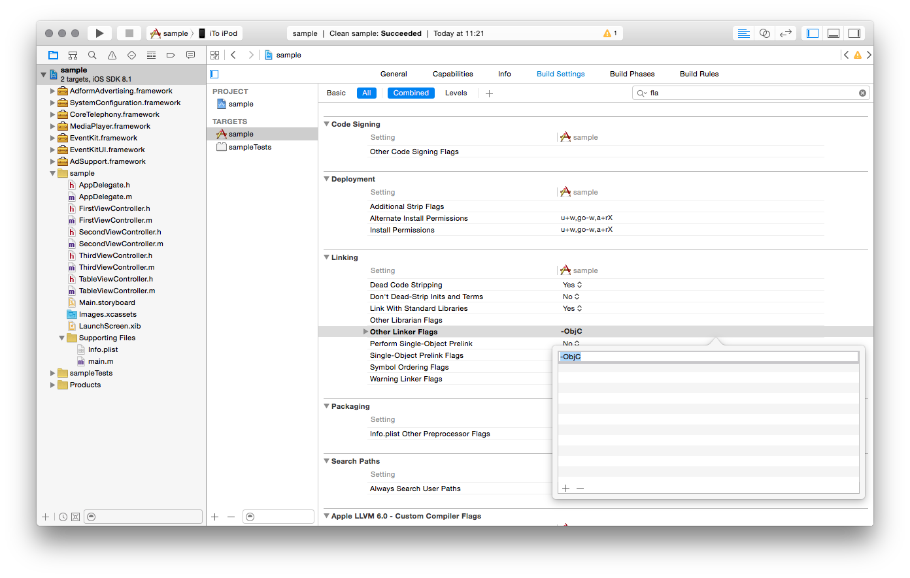

* Finaly import **AdformAdvertising.h** and you are ready to use Adform banners:
    
		#import <AdformAdvertising/AdformAdvertising.h>
		
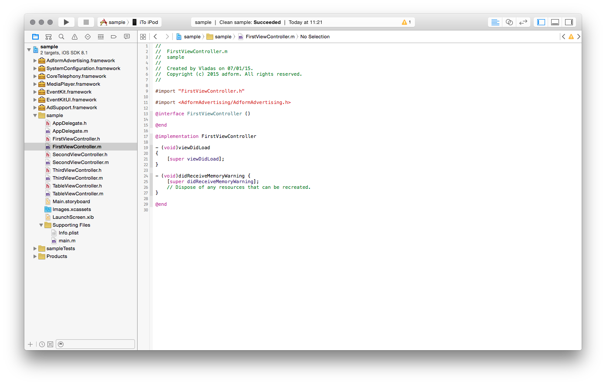

## 3. Basic AFAdView implementation
It is very easy to use Adform Advertising SDK to place ad banners in your application. The example code provided below shows you how to add an ad view to your view controller. You just need a Master Tag Id and you can display ads in your application.

	#import "ViewController.h"
	#import <AdformAdvertising/AdformAdvertising.h>

	@implementation ViewController

	- (void)viewDidLoad
	{
		[super viewDidLoad];
    
   		//Create a new ad view with Master tag id and position
    	AFAdView *adView = [[AFAdView alloc] initWithMasterTagId:mtag position:AFAdViewPositionBottom];
    	
    	//Set presenting viewController
    	adView.presentingViewController = self;
    	
    	//Add the newly created ad view as a subview to view controllers view
    	[self.view addSubview:adView];
    
    	//Iniate ad loading
    	[adView loadAd];
	}

	@end
	
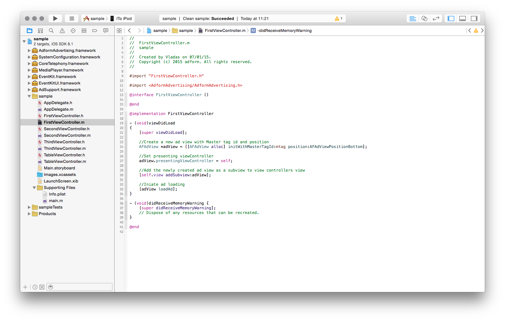

Thats it! You are ready to go.

# Sample Integrations

## 1. Responding to ad view size changes
Adform ad view is shown only when advertisemnt is loaded. If no ad is loaded it is hidden. Transitions between these states are automatically animated, so you should reposition your applications content accordingly. To do so you must implement `AFAdViewDelegate` protocol methods: `adViewWillShow:` and `adViewWillHide`. The example code provided below shows you how to reposition UITextView to prevent its content from being hidden by the ad view. You should not rely on the ad view `frame` property to determen its size and instead use `adSize` property.

	- (void)adViewWillShow:(AFAdView *)adView {

    	UIEdgeInsets insets = _textView.contentInset;
   		insets.bottom += adView.adSize.height;
    	UIEdgeInsets scrollInsets = _textView.contentInset;
    	scrollInsets.bottom += adView.adSize.height;
    	[UIView animateWithDuration:kBannerAnimationDuration
                     	animations:^{
                         	_textView.contentInset = insets;
                         	_textView.scrollIndicatorInsets = scrollInsets;
                     	}];
	}

	- (void)adViewWillHide:(AFAdView *)adView {
    
        UIEdgeInsets insets = _textView.contentInset;
       	insets.bottom -= adView.adSize.height;
       	UIEdgeInsets scrollInsets = _textView.contentInset;
       	scrollInsets.bottom -= adView.adSize.height;
       	[UIView animateWithDuration:kBannerAnimationDuration
                       	animations:^{
                           	_textView.contentInset = insets;
                           	_textView.scrollIndicatorInsets = scrollInsets;
                       	}];
	}
	
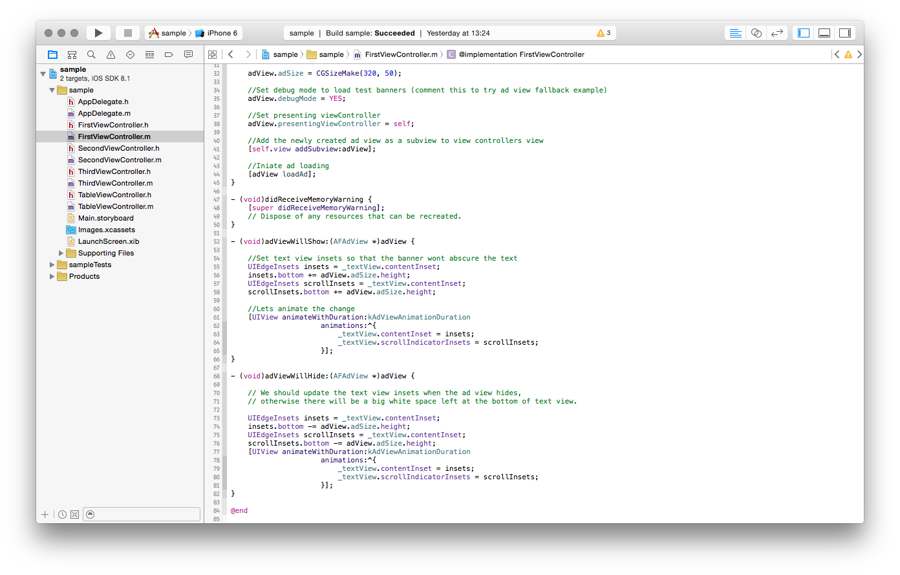
	
## 2. What does ad view position mean?
When creating an ad view you can provide three ad view positions:

1. **`AFAdViewPositionTop`** - ad view is automatically positioned at the top of its container view, horizontaly centered in it. You should not set its frame manualy because it may result in unexpected ad view behavior.
2. **`AFAdViewPositionBottom`** - ad view is automatically positioned at the bottom of its container view, horizontaly centered in it. You should not set its frame manualy because it may result in unexpected ad view behavior.
3. **`AFAdViewPositionCustom`** - when using this position, you must manually position the ad view in its container view by setting frame.origin property. The example code provided below shows you how to position an ad view manually. You should use this position type only if you want to add an ad view inside your applications content, eg. place it inside scroll view together with other application content.

		//Create new ad view with position AFAdViewPositionCustom
		AFAdView *adView = [[AFAdView alloc] initWithMasterTagId:mtag position:AFAdViewPositionCustom];
		
		//Set presenting viewController
    	adView.presentingViewController = self;

		//Get ad view frame property
    	CGRect frame = adView.frame;

		//Calculate ad view origin to place banner bellow label, horizontally centered in scrollView
    	frame.origin = CGPointMake((self.scrollView.frame.size.width - adView.frame.size.width) / 2, self.label.frame.origin.y + self.label.frame.size.height);

		//Set new, calculated ad view frame
    	adView.frame = frame;

		//Add ad view to scrollView
    	[self.scrollView addSubview:adView];

		//Initiate ad loading
    	[adView loadAd];

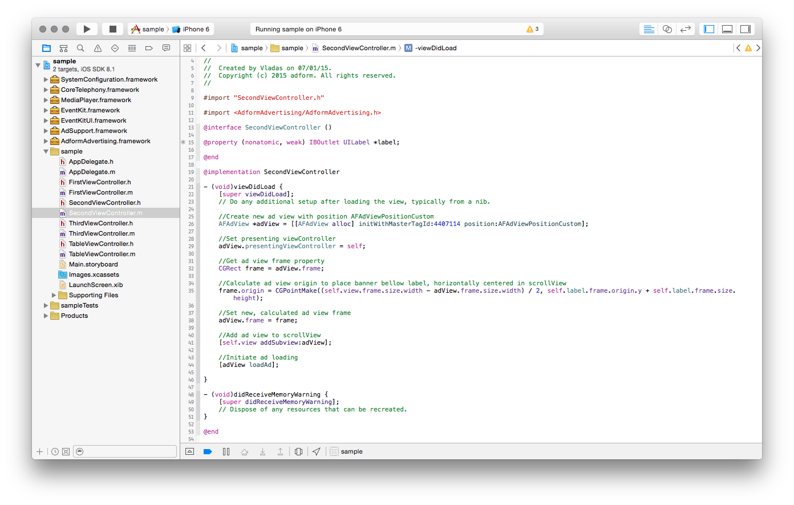

## 3. Adding ad views to UITableView

Adform ad view can be added to a table view contaners. It can be added as a table view section's header or footer and inside table view cells also. When adding ad view to table view you should ensure that you are properly reusing views to avoid performance issues. The example code provided below shows you how to add ad views to tablew view as section footers.

	- (CGFloat )tableView:(UITableView *)tableView heightForFooterInSection:(NSInteger)section {
	
		return [AFAdView defaultAdSize].height; //Returns default ad view size 320x50 for iPhone and 728x90 for iPad, you should use some kind of constant defining the size of your ad placement
	}

	- (UIView *)tableView:(UITableView *)tableView viewForFooterInSection:(NSInteger)section {
    
    	UITableViewHeaderFooterView *footerView = [tableView dequeueReusableHeaderFooterViewWithIdentifier:@"AdViewFooterIdentifier"];
    
        if (!footerView) {
            footerView = [[UITableViewHeaderFooterView alloc] initWithReuseIdentifier:@"AdViewFooterIdentifier"];
            
			AFAdView *adView = [[AFAdView alloc] initWithMasterTagId:mtag position:AFAdViewPositionBottom];
            adView.presentingViewController = self;
            [footerView.contentView addSubview:adView];
            [adView loadAd];
    	}     
    
    	return footerView;
	}

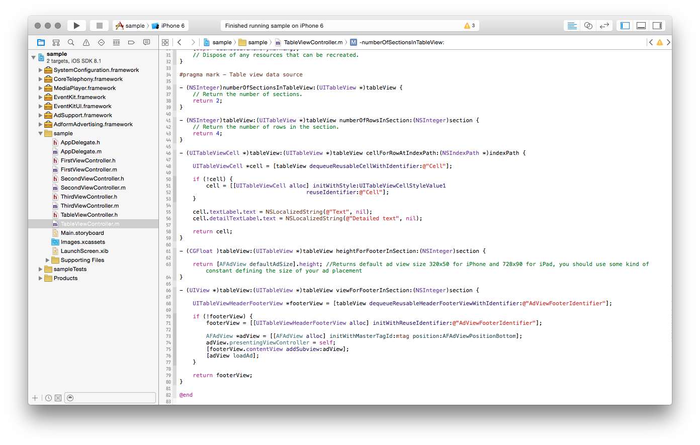

## 4. Displaying interstitial ads

It is very easy to display interstitial ads with Adform Advertising SDK. You just need to intitialize `AFInterstitialAdView` and display it.  To display interstitial ad you have two options:

1. You can just call `showFromViewController:animated:` method on `AFInterstitialAdView` object and it will handle everything, first it will load the ad and then display it to the user. If you pass `animated` parameter as `TRUE` to this method the interstitial ad view will be presented/hidden with fade in/out animations, if you pass `FALSE` - ad view presentation and dismissal won't be animated;
2. If you want more control over ad display (show on precise time) you can preload the ad first and then show it manually.

The example code provided below shows you how to display interstitial ad using the second display method.

	...
	
	//First, you must create property or ivar to retain the AFInterstitialAdView object (so that arc won't release it before we display it):
	@property (nonatomic, strong) AFInterstitialAdView *interstitialAdView;
	
	...
	
	- (void)viewDidLoad {
	
		[super viewDidLoad];
		
		//Second, initialize interstitialAdView and set its delegate:
		self.interstitialAdView = [[AFInterstitialAdView alloc] initWithMasterTagID:MasterTagID];
   		self.interstitialAdView.delegate = self;

		//Third, start ad loading:
		[self.interstitialAdView preloadAd];
	}
		
	//Finaly, wait until the ad is loaded and then you can call show to display the interstitial ad:
	- (void)interstitialAdViewDidLoadAd:(AFInterstitialAdView *)interstitialAdView {
    	
    	[self showInterstitial];
	}
	
 	- (void)showInterstitial {
 	
 		//You can check if AFInterstitialAdView is loaded by checking its isLoaded property
 		if (self.interstitialAdView.isLoaded) {
 			[self.interstitialAdView showFromViewController:self animated:TRUE];
 		}
 	}
 		
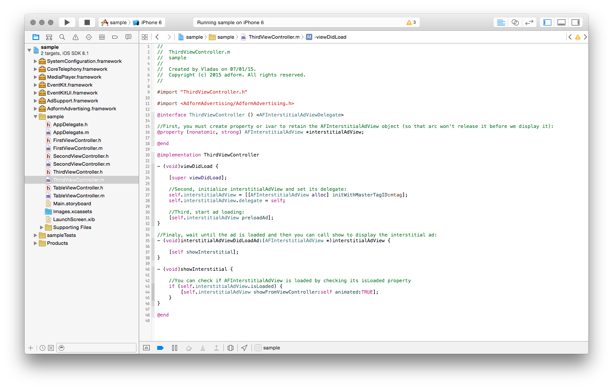


## 5. Adding custom values to Adform Advertising SDK

Publisher id is set globally using main `AdformSDK` class and `setPublisherId:andCustomData:` method. Custom data is an optional parameter and you can pass nil to this method. However, if you want to target your users more accurately you should use "custom data" parameter. It is a `NSDictionary` object containig key-value pairs (e.g. {"gender":"male"}) and is set globally to all ad requests. This parameter should be set before loading any ads, because after a successful request to the server (with this parameter) "custom data" cannot be modified (you can still set it if you haven't done it before loading the ads). The best place to set "custom data" parameter is `application:didFinishLaunchingWithOptions:` application delegate method. The example code bellow shows you how to set "custom data" parameter:

	- (BOOL)application:(UIApplication *)application didFinishLaunchingWithOptions:(NSDictionary *)launchOptions
	{
		//Create custom data parameter dictionary, we are using literal definition for this, but you can use any other definition as well
		NSDictionary *customData = @{@"gender": @"male", @"age": @"20"};
		
    	//Set AdformSDK custom data parameter
    	[AdformSDK setPublisherId:PublisherID andCustomData:customData];
    	
    	return YES;
	}

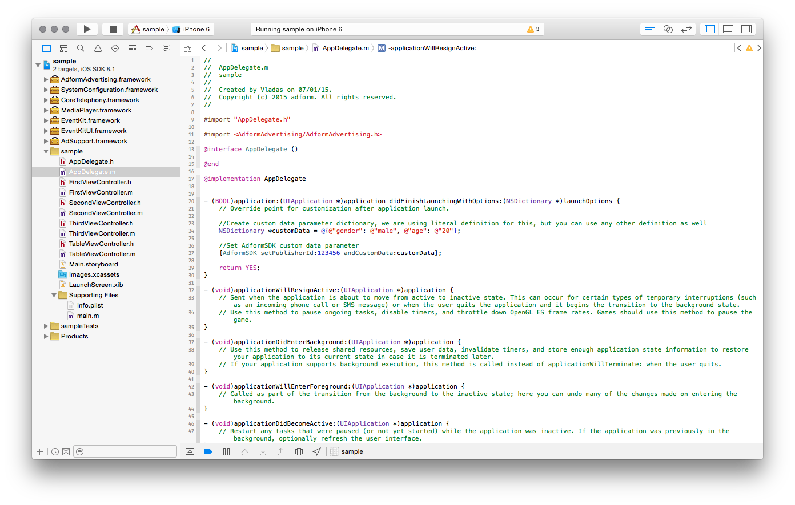

## 6. AFAdViewDelegate and AFInterstitialViewDelegate protocols
You can use `AFAdViewDelegate` and `AFInterstitialViewDelegate` protocols to get callbacks when ad view states change or events occure. By using these protocols you can track ad view load state, get callbacks about their visibility changes ant be informed about various events such as when ad view opens an internal web browser or a modal view. An example below shows you how to track ad view loading state, analogous code can be used with interstitial ad views.

	...
	//We must define that our view conntroller conforms to AFAdViewDelegate protocol
	@interface ViewController () <AFAdViewDelegate>

	...
	
	- (void)viewDidLoad
	{
   		[super viewDidLoad];
		// Do any additional setup after loading the view, typically from a nib.
    
    	//Create an AFAdView object
    	AFAdView *adView = [[AFAdView alloc] initWithMasterTagId:444444 position:AFBannerPositionBottom];

		//Set a delegate to the newly created AFAdView object
    	adView.delegate = self;

		//Add it to view hieararchy and start loading
    	[self.view addSubview:adView];        
    	[adView loadAd];
	} 

	...
	
	//Finaly we must define two methods which will get called when our ad view either finishes loading or fails to load
	
	- (void)adViewDidLoadAd:(AFAdView *)adView {
    	
    	//This method gets called when an ad view finishes loading a new ad
	}

	- (void)adViewDidFailToLoadAd:(AFAdView *)adView withError:(NSError *)error {
    
    	//This method gets called when an ad view fails to load an ad
    	//An error object describes what went wrong
	}

If our ad view fails to load, you can use `adViewDidFailToLoadAd:withError:` method to add any backup logic, such as loading an ad view from another SDK, but dont forget that AFAdView autorefreshes. The default refresh interval for a banner is 30 seconds if it is not set differently by the ad publisher. If ad request was successfull but no ad was received from the server an error with code -997 will be passed to this method.

The most common case to replace SDK with fallback image in case of failure:

	- (void)bannerViewDidFailToLoadAd:(AFBannerView *)bannerView withError:(NSError *)error {
	    
	    NSLog(@"Your message here");
	    
	    UIImageView *imageView = [[UIImageView alloc] initWithImage:[UIImage imageNamed:@"banner_fallback.png"]];
	    
	    imageView.frame = CGRectMake((self.view.bounds.size.width - imageView.bounds.size.width) / 2, (self.view.bounds.size.height - imageView.bounds.size.height), imageView.bounds.size.width, imageView.bounds.size.height);
	    imageView.autoresizingMask = (UIViewAutoresizingFlexibleLeftMargin | UIViewAutoresizingFlexibleRightMargin | UIViewAutoresizingFlexibleTopMargin);
	    
	    [self.view addSubview:imageView];
	    
	}
	
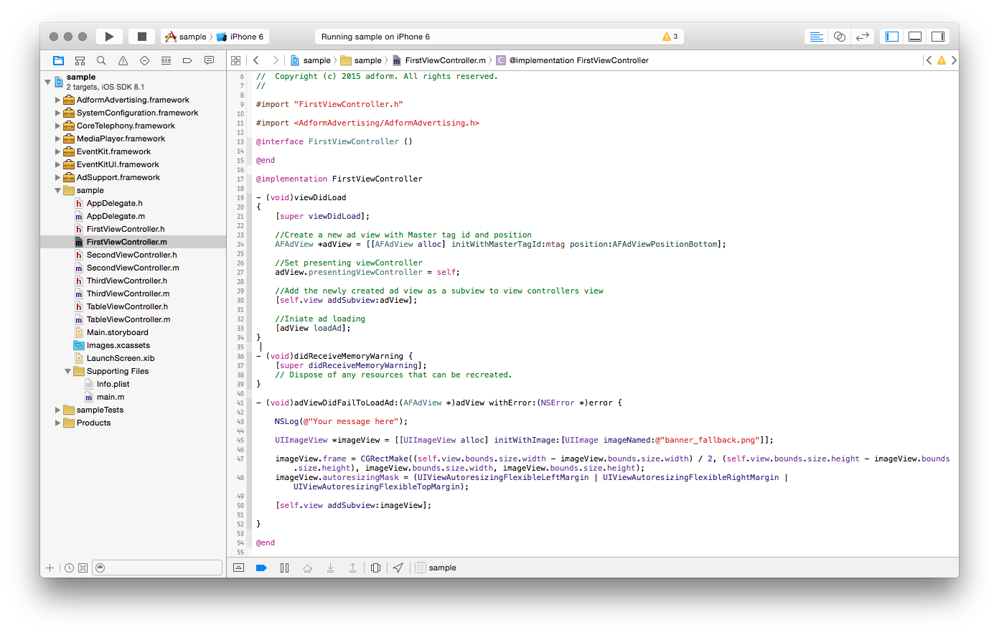

And the result will be image fallback:

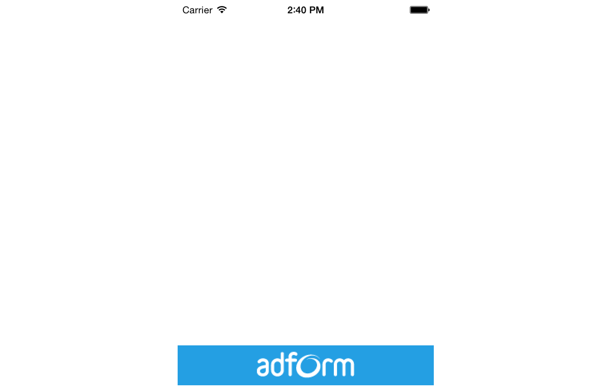

# Release Notes

This part lists release notes from all versions of Adform Mobile Advertising iOS SDK.

## 0.2.1

### New Features

* Added interstitial ads animation controll;

## 0.2

### New Features

* Added interstitial ads support;

### Additional dependencies

Don't forget to add new dependancies to your project if you are updating our SDK from 0.1.x version.

* EventKit.framework
* EventKitUI.framework
* MediaPlayer.framework
* CoreTelephony.framework


## 0.1.2

### New Features

* Added refresh Rate override option;
* Added AFBannerViewDelegate protocol;

## 0.1.1

### Bug Fixes

* NewRelic library made as optional;

## 0.1.0

### New Features

* First release;
